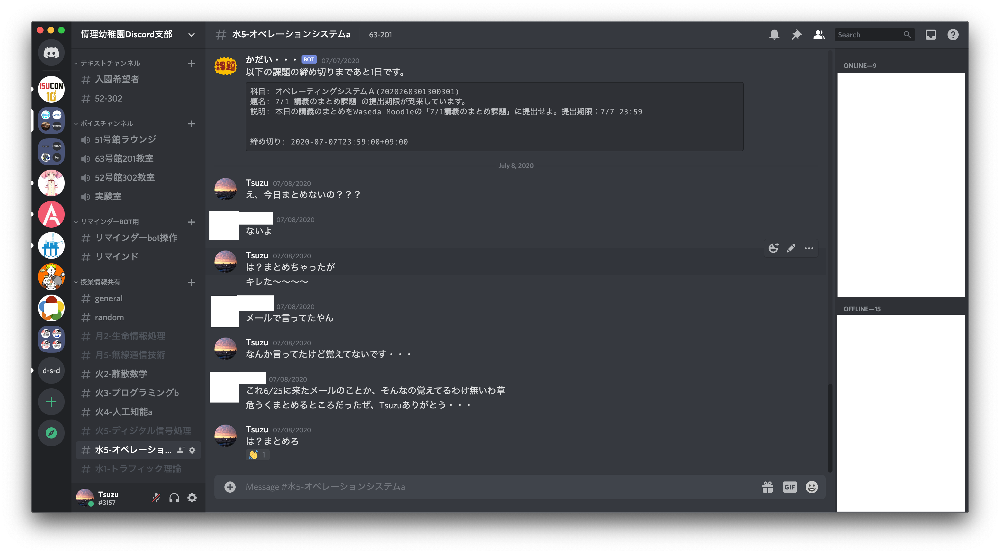
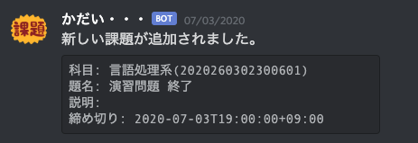
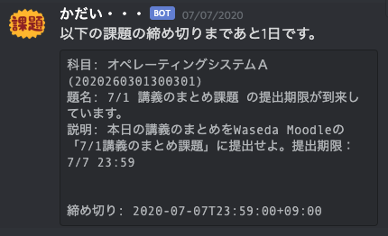
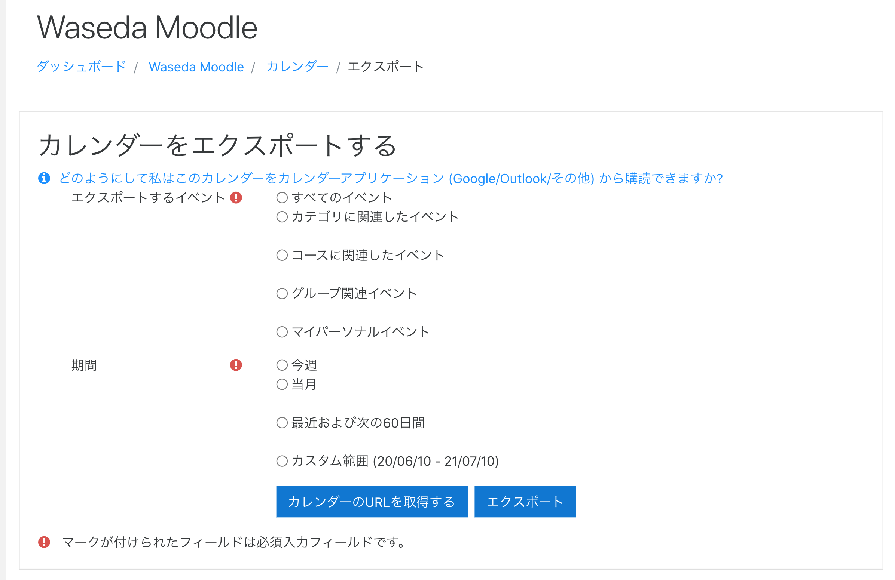
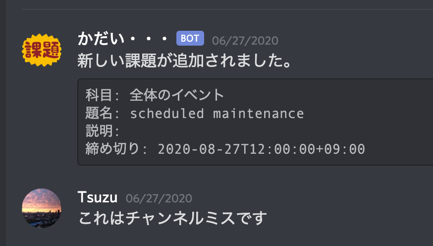
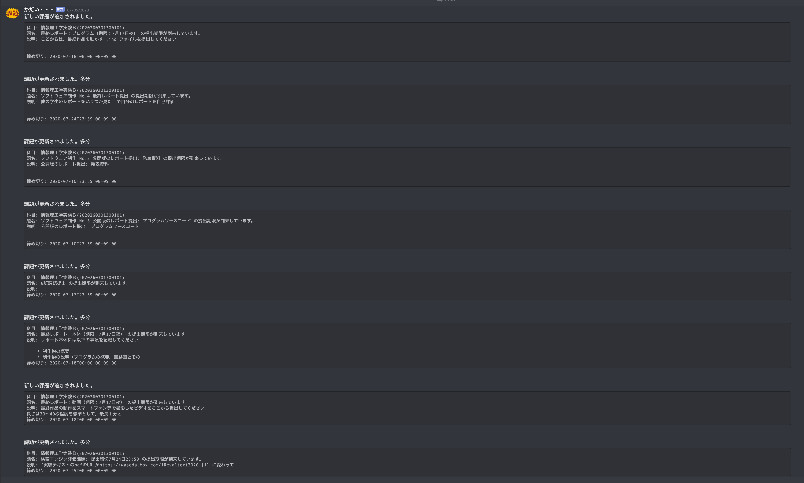

## 課題BOT on Discord
### 53代 Tsuzu

@MIS.Wプロ研発表会2020夏

---


# だれ?
- 53代 Tsuzu
- 基幹理工学部情報理工学科3年
- SysAd係・Web班長
- 好きなもの: Go言語、Kubernetes、Gopherくん(?)
- 趣味： Podcast、YouTube、アニメ
- Twitter: [@Wp120_3238](https://twitter.com/Wp120_3238)、[@tsuzu_misw](https://twitter.com/tsuzu_misw)(みす垢)
- GitHub: [cs3238-tsuzu](https://github.com/cs3238-tsuzu)

---
# Agenda
- 作ったものの概要
- iCalendar
- いい感じにチャンネルマッチしたい
- Known Issues
- まとめ

---
# 課題、忘れずに出せていますか?

---
# 魔境、情理B3 Discord...



---
# 何を作ったか
- 課題通知Bot on Discord
- 開発期間: 5時間ぐらい?
- Waseda Moodleに追加された課題を通知
    - 追加時
    - 更新時
    - 締め切りN時間前など
- https://github.com/cs3238-tsuzu/kadai-bot

---
# 技術概要
- ~~まぁもちろん言うまでもなく~~ Go
- github.com/etcd-io/bbolt をデータベースとして使ってる
- github.com/bwmarrin/discordgo DiscordのGo向けライブラリ 使いやすかった
    - Webhookはいらない
- AWS Lightsailで動かしてる

---
# こんな感じ



---
# こんな感じ


---
# 課題取得をどうやってるか
- https://wsdmoodle.waseda.jp/calendar/export.php


---
# iCalendar
- RFC5545
- スケジュールを同期するためのフォーマット
- Google Calendarとかで取り込める
- https://ja.wikipedia.org/wiki/ICalendar
```text
BEGIN:VEVENT
UID:273877@wsdmoodle.waseda.jp
SUMMARY:演習 開始
DESCRIPTION:
CLASS:PUBLIC
LAST-MODIFIED:20200706T102728Z
DTSTAMP:20200710T142417Z
DTSTART:20200707T014000Z
DTEND:20200707T014000Z
CATEGORIES:離散数学(2020260701300401)
END:VEVENT  
```

---
# iCalendarのまともなライブラリなさすぎ
- あんまり需要がなさそう
- Perl向けは充実してた
- シンプルなプロトコル故に雑な実装でも動いちゃう→バグりがち
- 唯一まともに動いたやつ: github.com/apognu/gocal

---
# いい感じにDiscordチャンネルをマッチしたい
- 情理Discordには科目ごとにチャンネルが存在
- 手動で科目とチャンネルをマッチングしたくない

---
# いい感じアルゴリズム
- 最初は普通の編集距離を検討したが...
```text
科目名: 情報理工学実験Ｂ(2020260301300101)
正チャンネル名: 金34-情理実験B (編集距離: 25)
誤チャンネル名: 木2-情報理論b (編集距離: 25)
```
※一応全角Bをいい感じに変換すれば正しく動作する

---
## そもそも編集距離(Levenstein Distance)とは

https://id.fnshr.info/wp-content/uploads/sites/2/2011/11/chatcter_edit.png

---
# いい感じアルゴリズム
- 置換と挿入のコストが一緒なのが微妙
- 関係ない文字を含んでいるときのコストを大きくしたい→2にした
```text
科目名: 情報理工学実験Ｂ(2020260301300101)
正チャンネル名: 金34-情理実験B (いい感じアルゴリズムの距離: 29)
誤チャンネル名: 木2-情報理論b (いい感じアルゴリズムの距離: 30)
```
完璧だね！

---
というわけで、課題の通知をできるようになりました
めでたしめでたし

---
# Known Issues(1/2)
- メンテナンスとかの謎イベントが別のチャンネルに飛んでく


---
# Known Issues(2/2)
- 教授が何かを項目をいじると関係ないやつが更新されたと認識される


---
# まとめ
- DiscordのBOTは簡単に作れるよ
- Goはいいよ
- 課題は溜めずに進めようね・・・
- あと3週間、頑張っていきましょう :muscle: